# Vivienda en España: necesidad, territorio, precios e instrumentos con datos públicos

## Informe técnico v5

- **Autor:** Borja Romero, economista (independiente).
- **Fecha:** 10 de octubre de 2026.
- **Versión:** `5.0`.
- **DOI:** pendiente.
- **Reproducción:** `make all` sin red, semilla `SEED=20261010`; comprobaciones con `make check`.
- **Cifras:** todas proceden de `output/v5/cifras_clave.csv` (tabla legible en `output/v5/cifras_clave.md`); este texto se genera desde una plantilla y no contiene cifras tecleadas.

---

## Resumen ejecutivo

**Qué hace este informe.** Ordena lo que se puede afirmar sobre la vivienda en España con datos públicos y con qué seguridad. Cada afirmación lleva una capa de evidencia: [C1] hecho confirmado por al menos dos fuentes independientes; [C2] cota con supuestos explícitos; [C4] exploratorio o de fuente única. En esta versión no hay ninguna afirmación de tipo C3 (efecto identificado con todos los controles): ningún resultado nuevo de v5 los supera.

**Lo que se sostiene con dos fuentes [C1].**
- Entre 2021 y 2024 el número de hogares creció más que el de viviendas terminadas: la diferencia está en 562.692-688.692 viviendas [C1]. Con bajas del parque supuestas, el rango se amplía a 562.692-902.808 viviendas [C2].
- Los hogares aumentaron en 997.586 hogares (981.823-1.013.350 hogares) entre 2021 y 2025 [C1].
- Se terminaron 72.264-94.426 viviendas/año en 2019-2024 (territorio común) [C1].
- El precio de compra subió 47,2 % (44,2-56,1 %) en 2015-2025 según el núcleo de tres fuentes (Ministerio, Notariado y Registradores) [C1]; el índice del INE marca 79,9 % [C4]. Los dos se dan siempre juntos.
- La renta del stock de contratos de alquiler subió 10,9-22,9 % en 2015-2024 [C1]; los contratos nuevos subieron más (sección de alquiler).
- Los hogares con vivienda principal en propiedad son 74,5 % de hogares (72,1-75,9 % de hogares) [C1].

**Lo que es una proyección o una contabilidad con supuestos [C4].**
- Necesidad de vivienda 2026-2035: 214.868 viviendas/año (93.628-309.921 viviendas/año) de media anual, suma de 52 provincias [C4]. El mayor componente es el crecimiento de hogares proyectado por el INE (1.720.540 hogares en diez años, [C2]).
- Déficit acumulado a fin de 2030 si se mantiene el ritmo actual de terminadas: 1.296.670 viviendas (872.529-1.447.950 viviendas) [C4], partiendo de 700.934 viviendas en 2021-2025. En el rango completo de supuestos, 20 provincias empeoran, 5 provincias mejoran y 27 provincias quedan indeterminadas [C4].
- El déficit está concentrado: 6 provincias suman la mitad del déficit positivo de 2021-2025 [C4].

**Lo que no se puede afirmar.**
- Ninguna descomposición de la subida de precios es estable: el orden de las familias de factores cambia con el método y el periodo (tau de Kendall mínima -0,71 tau (4 familias)) [C4]. Se habla de «contribuciones contables», no de atribuciones.
- Las diferencias de precios entre provincias se describen, no se atribuyen: el pre-registro de B3 tenía potencia insuficiente y el resultado es «descriptivo honesto» [C4].
- No se dispone de datos públicos sobre la distribución del parque por tipo de propietario (personas jurídicas, grandes tenedores); las afirmaciones del debate sobre ese punto quedan sin analizar por falta de datos.

**Instrumentos.** Con la misma rúbrica se evalúan 36 instrumentos; en 18 instrumentos el signo no es evaluable con la evidencia disponible [C4]. Donde la oferta no responde (clase `2` de A4), una ayuda general a la demanda se trasladaría al precio en 100,0 % según la rejilla de elasticidades [C4]. Lo que aparece con signo estable en la rejilla de v3 es más construcción donde falta y la movilización de vacías [C2 en el signo; C4 en la magnitud].

**Convergencia.** Frente a BdE, Ministerio, INE, OCDE y Eurostat, y solo cuando concepto, periodo y cobertura son comparables, las cifras del proyecto coinciden en 2 y difieren en 1; otras 6 son comparables solo en parte (otro periodo o concepto), 4 comparten fuente primaria con el proyecto y no cuentan, y 9 no son comparables [C4]. Las diferencias se describen por periodo, concepto o bajas del parque.

**Cómo está organizado.** El diagnóstico nacional abre el informe (déficit, hogares, terminadas, precios, alquiler y Europa). Siguen la necesidad futura por provincia y la proyección a 2030, el territorio (concentración, clases y diferencias provinciales), la pregunta de qué se asocia con la subida, el parque frente al mercado, los instrumentos, la política por territorio, el módulo València, la convergencia con organismos y las limitaciones. Cada sección termina con una «Lectura» que resume lo que se puede y lo que no se puede decir.

**Qué cambia respecto a v4.** El coste de construcción deja de ser un supuesto y pasa a ser un rango oficial; se añade una contabilidad de necesidades a diez años y una proyección a 2030; se reconcilian el índice de precios del INE y el núcleo de tres fuentes; se separan los contratos de alquiler nuevos de los existentes; las diferencias provinciales se estudian con un pre-registro; la matriz de instrumentos se amplía y se cruza con el territorio; y todas las cifras se contrastan con las de los organismos públicos.

---

## Guía de capas

| Capa | Qué exige | Cómo se lee en el texto |
|---|---|---|
| C1 · Hecho | al menos dos fuentes independientes, con todos los componentes en C1, dentro de una tolerancia declarada | «es», «fue», «creció» |
| C2 · Cota | identificación parcial (Manski) con supuestos explícitos y escritos | «como máximo», «como mínimo», «entre … y …» |
| C3 · Efecto | diseño con pretendencias, placebos, sensibilidad y muestra sellada | no hay ninguno nuevo en v5 |
| C4 · Exploratorio | fuente única, proyección, supuestos no contrastados o asociación | «se asocia», «coincide», «es compatible con» |

Reglas que se aplican en todo el informe:
- La capa de una cifra es la menor de las de sus componentes. Por eso cifras habituales en el debate (el déficit 2021-2025, el peso de los compradores no residentes, las vacías) quedan en C4.
- Nunca se promueve una cifra de capa: una cifra C4 no pasa a C1 por repetirse o por coincidir con un organismo que usa la misma fuente.
- Sin lenguaje causal por debajo de C3. Las descomposiciones son «contribuciones contables».
- Si dos métodos discrepan, se dan los dos. Los resultados negativos se reportan.
- Se evalúan afirmaciones e instrumentos; nunca a quien los propone.

---

## 1. Diagnóstico

### 1.1 Déficit: 2021-2024 (C1) y 2021-2025 (C4)

**Definición.** El déficit contable es el aumento del número de hogares menos las viviendas terminadas en el mismo periodo. No incluye la demanda latente (jóvenes que no se emancipan) ni la vivienda que sale del parque, salvo que se diga.

**2021-2024 [C1].** Con dos fuentes independientes en cada componente (hogares: ECP y EPA corregida por la ruptura de 2021; terminadas: Ministerio y Catastro), el déficit está entre 562.692-688.692 viviendas. Es la única ventana en la que todos los componentes pasan la regla de dos fuentes (562.692-688.692 viviendas (2021-2024; hogares: ECP y EPA corregida; terminadas: Ministerio y Catastro; dato de 2024; C1)).

**Con bajas del parque [C2].** Si se suponen bajas anuales del parque en el rango declarado en v4, el déficit 2021-2024 queda entre 562.692-902.808 viviendas [C2]. La cota inferior es la cifra sin bajas; la superior, la de bajas máximas.

**2021-2025 [C4].** Al añadir 2025, uno de los componentes pasa a depender de una sola fuente y el resultado baja a C4: 700.934 viviendas (700.934-700.934 viviendas) con bajas nulas [C4]. Por provincias, la mediana entre combinaciones de fuentes reparte ese total con un rango por provincia (`output/v5/A4/clasificacion_provincias.csv`).

**Lectura.** La cifra que conviene citar con seguridad es la de 2021-2024 [C1]. La de 2021-2025 es la habitual en el debate y coincide en orden de magnitud con las del Banco de España (sección de convergencia), pero es C4.

**Por qué no coinciden las cifras del debate.** Las cifras de déficit que circulan difieren por cuatro motivos, que se pueden separar: el periodo (con o sin 2021, con o sin 2025), la fuente de hogares (con o sin la corrección de la ruptura de la EPA de 2021), la fuente de terminadas (certificados de fin de obra o altas en el Catastro) y el tratamiento de las bajas del parque. La conciliación de v4 cerraba exactamente con una cadena de pasos; en v5 se mantiene y se añade la comparación con los organismos (sección de convergencia). Ninguna de las cifras es «la verdadera»: cada una responde a una definición.

### 1.2 Hogares

- Entre 2021 y 2025 los hogares aumentaron en 997.586 hogares (981.823-1.013.350 hogares) [C1] (INE ECP y EPA corregida por la ruptura de 2021).
- La demanda latente de jóvenes que viven con sus padres, frente a la tasa de convivencia de 2008, está entre 188.000-506.000 hogares [C2]. Es una cota: supone que la tasa de 2008 es la de referencia.
- El INE proyecta 1.720.540 hogares más en 2026-2035 [C2] y 1.024.160 hogares en 2026-2030 [C2]. Es un escenario del INE: no reacciona a la oferta ni a los precios.
- La descomposición contable de v4 (población por nacionalidad, edad y jefatura) se mantiene sin cambios en v5 y es C4 en los componentes de fuente única (`output/v4/M2`).

### 1.3 Viviendas terminadas

- En 2019-2024 se terminaron 72.264-94.426 viviendas/año en territorio común (sin País Vasco ni Navarra) [C1]: Ministerio (certificados de fin de obra) y Catastro (altas) coinciden dentro de la tolerancia declarada.
- El ritmo de 2023-2025 proyectado a cinco años da 473.250 viviendas (402.475-648.361 viviendas) en 2026-2030 [C4].
- El retardo medio entre iniciadas y terminadas es de 3,2 años (3,0-3,2 años) [C4].
- La cartera en construcción (iniciadas menos terminadas en dos o tres años) es de 89.815 viviendas (75.674-103.956 viviendas) [C4].
- Capacidad del sector: los ocupados en construcción por vivienda libre iniciada pasan de 10,3 personas por vivienda en 2008 a 35,2 personas por vivienda en 2013 y 12,6 personas por vivienda en 2025 [C4]. El coste de construcción (Eurostat) creció -18,8 puntos porcentuales menos que el precio entre 2014 y 2025 [C4]. Con estos datos no se contrasta si hay un cuello de botella de mano de obra.

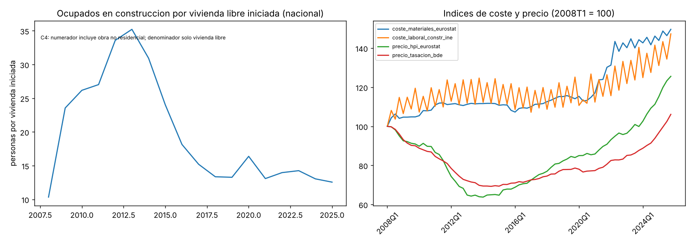

**Lectura.** El ritmo de terminadas de los últimos años es muy inferior al aumento de hogares, y el ratio de ocupados por vivienda iniciada ha vuelto a niveles parecidos a los de antes de la crisis financiera. Eso es compatible con una capacidad del sector que no es el único freno, pero con datos agregados no se puede separar la capacidad del sector de la rentabilidad, el suelo o la tramitación.

### 1.4 Precios: el puente IPV frente al núcleo

**Dos medidas que no coinciden.**
- Núcleo de tres fuentes (Ministerio, valor tasado; Notariado; Registradores): 47,2 % (44,2-56,1 %) en 2015-2025, medias anuales [C1].
- Índice de precios de vivienda del INE: 79,9 % [C4]. Eurostat publica el mismo índice, de modo que la coincidencia con Eurostat no es una segunda fuente.

**El puente.** Se reconcilian las dos medidas paso a paso, en logaritmos y con pesos comunes:
- reponderar el IPV con pesos de comunidades autónomas comunes cambia 0,60 pp [C4];
- la composición entre vivienda nueva y usada en la media de precio por metro cuadrado aporta 0,00 pp [C4];
- con pesos provinciales de 2015, Registradores sube 66,8 % y con pesos de comunidades 63,8 % [C4]: la reponderación geográfica amplía la diferencia en lugar de reducirla;
- queda un residuo no identificado de -30,9 pp [C4], compatible con diferencias de método (hedónico frente a medias o medianas), calidad, tamaño y cobertura, que no se pueden separar con los datos del repositorio.

**Factor común.** Las cuatro fuentes se mueven juntas: el primer componente principal recoge 89,2 % de la varianza de las variaciones anuales [C4]. El desacuerdo está en el nivel acumulado, no en la dirección.

**Niveles.** Registradores 2.284 EUR/m2 y Notariado 1.949 EUR/m2 en 2025 [C4], fuentes únicas por concepto.

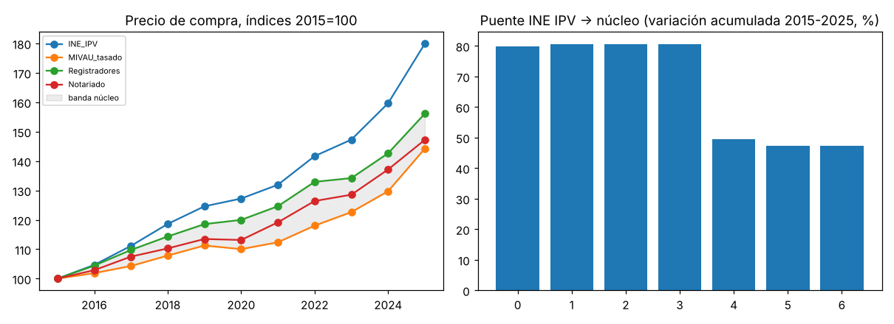

**Lectura.** «La vivienda ha subido un ochenta por ciento» y «ha subido la mitad» describen dos medidas distintas. Este informe da las dos y cita el núcleo como C1.

### 1.5 Alquiler: stock frente a contratos nuevos

- **Stock de contratos (todos los vigentes).** El núcleo IPC de alquiler e IPVA de contratos existentes da 10,9-22,9 % en 2015-2024 [C1]. SERPAVI, con composición constante, da 43,0 % [C4].
- **Contratos nuevos.** El IPVA de nuevo contrato sube 37,0 % en 2015-2024 [C4]; en Cataluña (Incasòl) 54,5 % en 2015-2025 [C4]; en la Comunitat Valenciana (fianzas de la GVA) 58,0 % en 2020-2025 [C4].
- **Dos fuentes por territorio [C1].** Cataluña 2021-2024: 16,9 % (16,6-17,2 %) (IPVA nuevo e Incasòl) [C1]; Comunitat Valenciana 2021-2024: 26,6 % (22,4-30,8 %) (IPVA nuevo y fianzas) [C1].
- **Brecha.** En 2024 los contratos nuevos están 13,6 % por encima de los existentes (IPVA) [C4]. La cuota implícita de contratos nuevos en el índice es 16,0 % (13,9-17,6 %) [C4].
- **Rotación.** Fianzas sobre contratos vigentes: 25,0 % en Cataluña y 13,5 % en la Comunitat Valenciana [C4].
- **Actualización.** Si todo contrato vigente se hubiese actualizado con el HICP, el stock habría subido 7,2 % más en 2022-2024 [C4]: es una contabilidad con supuestos, no un contrafactual de una norma.

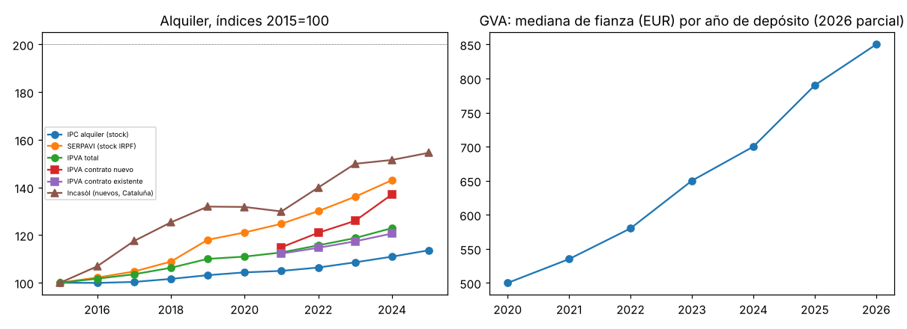

**Lectura.** El IPC de alquiler mide lo que pagan todos los inquilinos; el que busca vivienda paga el precio de contrato nuevo. Las dos cifras son correctas y miden cosas distintas.

**Por qué importa la distinción.** Una política que se evalúe con el IPC de alquiler verá cambios lentos, porque la mayoría de los contratos vigentes no se renuevan cada año; una que se evalúe con los contratos nuevos verá cambios más rápidos y más volátiles. Las dos cifras deben citarse con su definición. La rotación medida con las fianzas es baja en las dos comunidades con datos: la mayoría de los hogares inquilinos no pasa por el mercado cada año, pero quien entra lo hace a precios de contrato nuevo.

### 1.6 Comparación europea

Posición de España en la Unión Europea de los veintisiete (Eurostat; Eurostat toma el dato de España del INE, así que es coherencia, no independencia) [C4]:

| Indicador | España, nivel | Cambio desde 2015 | Capa |
|---|---|---|---|
| Precio real de la vivienda | — | 42,6 % acumulado desde 2015 | C4 |
| Alquiler real (IPCA) | — | -10,3 % acumulado desde 2015 | C4 |
| Tenencia en propiedad | 73,6 nivel % población | -4,6 cambio desde 2015 (% población) | C4 |
| Alquiler a precio de mercado | 17,4 nivel % población | 4,7 cambio desde 2015 (% población) | C4 |
| Edad media de emancipación | 30,2 nivel años | 1,2 cambio desde 2015 (años) | C4 |
| Hacinamiento | 9,5 nivel % población | 4,0 cambio desde 2015 (% población) | C4 |
| Sobrecarga de coste | 7,2 nivel % población | -3,1 cambio desde 2015 (% población) | C4 |
| Viviendas con permiso por mil habitantes | 4,1 nivel viv./1.000 hab. | 3,3 cambio desde 2015 (viv./1.000 hab.) | C4 |
| Crecimiento de la población | 9,4 nivel por 1.000 hab. | — | C4 |
| Migración neta | 11,8 nivel por 1.000 hab. | — | C4 |

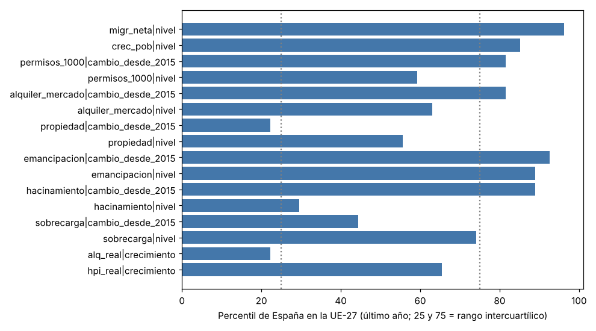

**Lectura.** Lo específico de España en 2025 es la combinación de crecimiento de la población y migración neta altos con un precio real que sube y un alquiler real (medido por el IPCA, que es un índice de stock) que baja [C4]. El rango del precio real (16,9-60,9 % acumulado desde 2015) refleja el desacuerdo entre fuentes de precio de la sección anterior.

---

## 2. Necesidades 2026-2035 por provincia (B1) y déficit a 2030 (B2)

### 2.1 Método de B1

La necesidad de vivienda es una contabilidad stock-flujo por provincia, con rango mínimo-central-máximo en cada componente:

**N = A + R + V + F − M − K**

| Componente | Qué es | Diez años, central (rango) | Capa |
|---|---|---|---|
| A | Atraso: déficit 2021-2025 más emancipación retrasada | 1.103.170 viviendas (stock) (830.963-1.473.640 viviendas (stock)) | C4 |
| R | Reposición del parque | 89.665 viviendas (1.070-178.259 viviendas) | C4 |
| V | Vacancia friccional en zonas con presión | 58.674 viviendas (0-117.348 viviendas) | C4 |
| F | Crecimiento de hogares (INE) | 1.720.540 hogares (1.308.530-1.772.410 hogares) | C2 |
| M | Vacías movilizables en zonas con presión | 733.553 viviendas (366.777-1.100.330 viviendas) | C4 |
| K | Cartera en construcción | 89.815 viviendas (75.674-103.956 viviendas) | C4 |
| L | Viviendas liberadas por envejecimiento (aparte; ya neta en F) | 1.415.260 viviendas (10 años) (801.982-2.170.070 viviendas (10 años)) | C4 |

Decisiones de método:
- F, del INE, ya es neta de disoluciones de hogares. Restar además L duplicaría: se da la fórmula literal solo como variante (733.415 viviendas en diez años) [C4].
- R se estima con dos métodos (Censo 2011-2021 más Ministerio; Catastro más Ministerio). En 38 provincias las tasas brutas de baja no son positivas en ninguno de los dos: se acotan a cero y R queda como límite inferior poco informativo [C4].
- Hogares compartidos, hacinamiento y habitaciones compartidas no tienen dato provincial accesible: el rango se da sin ellos.
- La capa del total es la menor de las de sus componentes: C4.
- No es un modelo predictivo: AR(4) y ECM v1 no aplican, y no hay contrastes que ajustar.

**Qué no incluye.** La necesidad no es demanda solvente: no dice cuántas viviendas se venderían o alquilarían a los precios actuales, sino cuántas harían falta para alojar a los hogares proyectados, absorber el atraso y reponer el parque, una vez descontadas las vacías movilizables y la cartera en construcción. Tampoco distingue entre vivienda en propiedad, alquiler libre o protegido: esa elección corresponde a la política, no a la contabilidad.

**Por qué el rango es amplio.** El rango refleja tres incertidumbres que se suman: el atraso de partida (que depende de la ventana y de las fuentes), el crecimiento de hogares (el INE da un escenario y el proyecto añade una alternativa) y la parte de las vacías que se puede movilizar (entre un décimo y tres décimos de las vacías en zonas con presión, un supuesto de la rejilla de v3). Las vacías movilizables son el componente que más reduce la necesidad y el más incierto.

### 2.2 Resultado de B1

- Necesidad total: 214.868 viviendas/año (93.628-309.921 viviendas/año) de media anual en 2026-2035, suma de 52 provincias [C4].
- En diez años: 2.148.680 viviendas (936.278-3.099.210 viviendas) [C4].
- Las provincias con presión (clases `1` a `3` de A4) son 48 provincias; concentran 2.110.220 viviendas de la necesidad a diez años [C4].
- Las cuatro mayores necesidades anuales: Madrid 47.228 viviendas/año, Barcelona 30.963 viviendas/año, València 16.993 viviendas/año y Alicante 14.264 viviendas/año [C4].

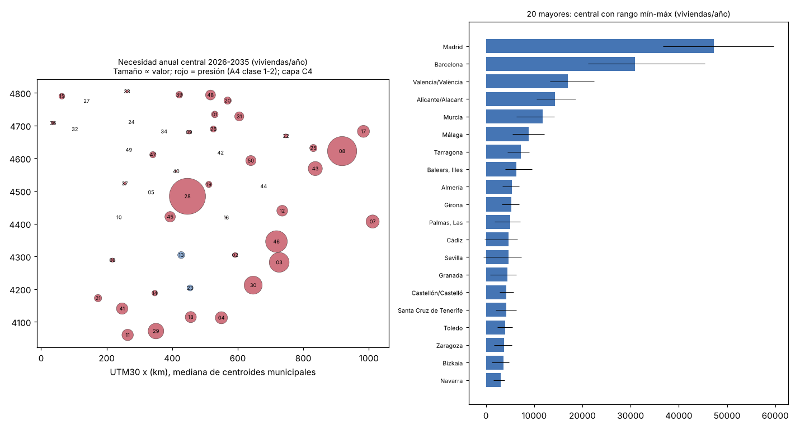

**Lectura.** La necesidad está concentrada donde ya hay déficit: las provincias con más necesidad anual son las mismas que encabezan el déficit contable de 2021-2025. Fuera de las provincias con presión, la necesidad procede sobre todo de la reposición y del crecimiento de hogares, y es pequeña.

### 2.3 Método de B2

`D2030 = D2025 + F − T + B`, por provincia:
- `D2025`: déficit 2021-2025 con bajas nulas, 700.934 viviendas [C4];
- F: hogares INE 2026-2030, 1.024.160 hogares [C2];
- T: terminadas, con tres escenarios: (a) media de 2023-2025 (473.250 viviendas en cinco años); (b) cartera con el retardo nacional de 3,2 años; (c) tendencia, solo como sensibilidad;
- B: bajas, de R de B1, que es un límite inferior.

El rango de cada provincia combina el mínimo y el máximo de F, la envolvente de T entre los escenarios (a) y (b) y el rango de B. El signo (mejora o empeora) se asigna solo cuando todo el rango tiene el mismo signo.

### 2.4 Resultado de B2

- Déficit nacional a fin de 2030 en el escenario (a): 1.296.670 viviendas (872.529-1.447.950 viviendas) [C4]. En el escenario (b), 1.136.180 viviendas; en el (c), 1.276.240 viviendas [C4].
- En el escenario central (a) empeoran 45 provincias; en el (b), 40 provincias; en el (c), 41 provincias [C4].
- Con el rango completo: empeoran 20 provincias, mejoran 5 provincias y quedan indeterminadas 27 provincias [C4]. El signo central coincide en los tres escenarios en 46 provincias.

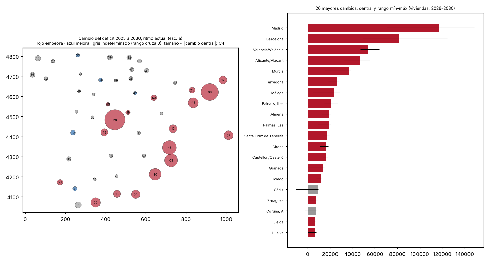

**Lectura.** Es una proyección bajo supuestos, no un pronóstico. Dice qué pasaría si las terminadas siguieran al ritmo reciente y los hogares crecieran como proyecta el INE. No incorpora la reacción de la oferta ni de la formación de hogares a los precios.

---

## 3. Territorio

### 3.1 Concentración

- En 2021-2025, 6 provincias suman la mitad del déficit positivo y 18 provincias suman cuatro quintas partes [C4].
- En 2021-2024 las cifras son 6 provincias y 17 provincias [C4].
- La concentración es estable entre ventanas: el déficit es un fenómeno de pocas provincias, con las grandes áreas urbanas y el litoral mediterráneo a la cabeza.

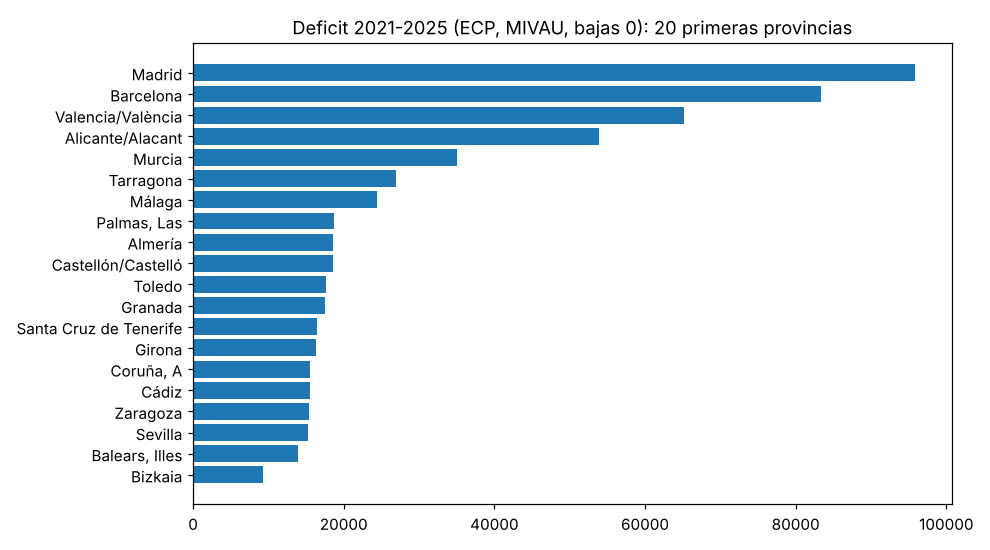

### 3.2 Clases de A4

**Cómo se clasifica.** Cada provincia se clasifica según dos preguntas: si falta vivienda (déficit 2021-2025 positivo) y si construir es rentable con un coste de construcción oficial. El coste procede del módulo básico de construcción de 1993 (BOE) actualizado con el índice de costes de Eurostat: 677,0 EUR/m2 construido (422,0-932,0 EUR/m2 construido) [C4]. En v4 el coste era supuesto; en v5 es un rango derivado de una norma.

| Clase | Definición | Provincias 2021-2025 (robustas) | Provincias 2012-2025 (robustas) |
|---|---|---|---|
| `1` | falta y es rentable | 37 (8) | 24 (13) |
| `2` | falta con freno regulatorio o de suelo: el precio supera coste y suelo con margen y la oferta no responde | 11 (3) | 6 (1) |
| `3` | falta y no es rentable con el coste oficial | 2 (0) | 0 (0) |
| `4` | no falta: déficit menor o igual que cero en la ventana | 0 (0) | 20 (8) |
| `9` | sin dato | 2 (1) | 2 (0) |

«Robustas»: la clase es la misma en todo el rango de costes, márgenes, tipos de descuento y holguras.

**Clase `4`.** Una provincia es de clase `4` cuando su déficit contable es nulo o negativo en la ventana: ha crecido más el parque que los hogares. En 2021-2025 no hay ninguna; en 2012-2025, que incluye los años de construcción de la década anterior, hay 20 provincias [C4]. Que una provincia sea de clase `4` no significa que no tenga problemas de acceso: significa que, en el agregado de la ventana, el parque creció más que los hogares.

**Nota de capa.** Todas las clases son C4. El déficit provincial de 2021-2025 es C4 (regla del componente más débil) y la rentabilidad depende de un coste derivado de una sola norma y un índice, que no es un coste de mercado observado. Por eso ningún resultado por clase (en D1 y D2) se promueve.

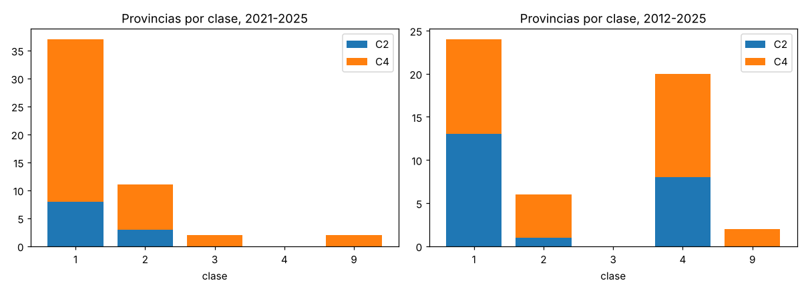

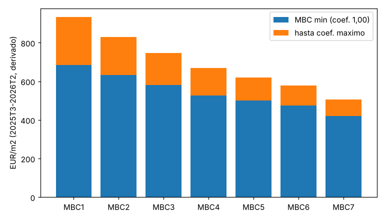

**Lectura.** Las clases ordenan el territorio según dos preguntas sencillas y transparentes, con un coste oficial en lugar de uno supuesto. Su valor está en que hacen explícito el supuesto del que depende cada recomendación condicional: la clase `2` lleva a mirar el suelo y la tramitación; la clase `3`, el coste; la clase `1`, la capacidad de producir más. Pero son exploratorias: un cambio razonable del coste puede mover una provincia de clase, y eso es lo que mide la columna de robustez.

### 3.3 Diferencias provinciales (B3): descriptivo honesto

**Pre-registro.** Antes de estimar se registraron las hipótesis, las variables, las ocho familias de factores y la corrección por comparaciones múltiples (`docs/v5/prereg_B3.md`, etiqueta `prereg-v5`). El análisis de potencia previo dio un efecto mínimo detectable con Holm de 0,62 DT (0,34-1,1 DT) [C4], por encima del umbral que el pre-registro consideraba útil. Por eso B3 se declara de antemano **descriptivo honesto**: describe con qué se asocian las diferencias entre provincias, sin pretender identificar nada.

**Diseño.** Corte transversal de 50 provincias (sin Ceuta ni Melilla), variación del precio 2015-2025, ocho familias de factores a la vez, errores `HC3` y Conley, inferencia por aleatorización y Holm.

**Resultados [C4].**
- El modelo de ocho familias tiene un R² de 0,91 proporción con el valor tasado.
- `H-B3-6` (precio inicial): -16,0 puntos logarítmicos (≈ %) por DT (-23,8--8,2 puntos logarítmicos (≈ %) por DT), p ajustado 0,00 probabilidad. Las provincias que partían de precios más bajos subieron más. Con el precio inicial de Registradores, para controlar el error de medida, el coeficiente baja a -9,0 puntos logarítmicos (≈ %) por DT y el p a 0,06 probabilidad: la asociación se mantiene en signo, pero parte de ella es mecánica (el error de medida del precio inicial empuja el coeficiente hacia valores negativos).
- `H-B3-1` (demanda sectorial tipo Bartik): 2,4 puntos logarítmicos (≈ %) por DT (-0,06-4,8 puntos logarítmicos (≈ %) por DT), p ajustado 0,33 probabilidad. No se distingue de cero.
- `H-B3-2` (crecimiento de la población): 3,5 puntos logarítmicos (≈ %) por DT (-0,74-7,8 puntos logarítmicos (≈ %) por DT), p ajustado 0,41 probabilidad. No se distingue de cero tras el ajuste.
- La validación cruzada dejando una provincia fuera da un RMSE de 0,07 log-puntos frente a 0,16 log-puntos del modelo de solo media [C4].

**Desviaciones del pre-registro.** Están todas en `output/v5/B3/desviaciones.md` y son exploratorias: renta medida con el PIB per cápita provincial en lugar de la renta por hogar; ventanas más cortas en alquiler y renta; validación por exclusión de una provincia en lugar de AR(4); acotación del parámetro de Oster.

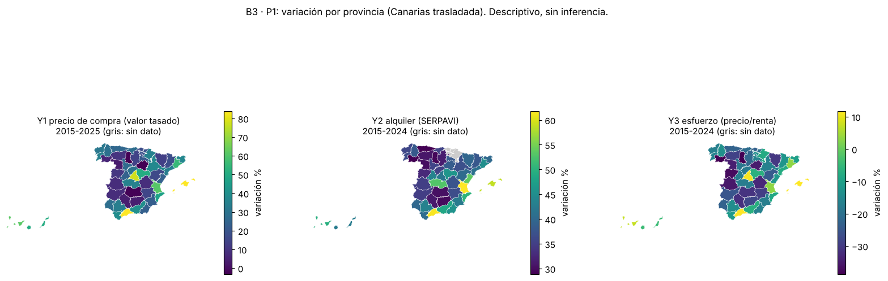

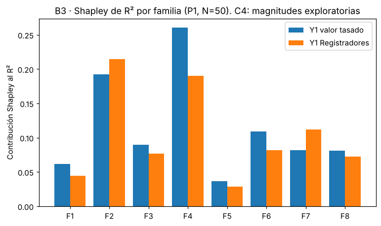

**Lectura.** Las provincias con mayor subida 2015-2025 se asocian con precios de partida más bajos, un patrón de convergencia que en parte es mecánico. El resto de factores no se distingue de cero tras corregir por comparaciones múltiples. Con medio centenar de unidades y ocho familias de factores correlacionadas, no se puede pedir más a un corte transversal; el pre-registro sirvió precisamente para decirlo antes de ver los resultados.

---

## 4. Qué explica la subida y con qué seguridad (B4): contribuciones no estables

**Pregunta.** ¿Cuánto de la variación del precio de compra y del alquiler se asocia con cada familia de factores (demografía, renta y empleo, financiación, oferta y suelo, turismo y no residentes), y es estable ese orden?

**Método.** B4 no estima nada nuevo: triangula salidas existentes.
- v2 (series temporales nacionales): contribución contable = coeficiente por variación media de cada variable, en puntos de variación logarítmica acumulada.
- B3 (corte transversal): reparto de Shapley del R² entre provincias.
- v3: cotas de cantidad.
Las unidades no son sumables entre métodos. La estabilidad se mide con la tau de Kendall del orden de las cuatro familias comunes.

**Contribuciones contables al precio de compra (v2, valor tasado real) [C4].**

| Familia | 2015-2019 | 2019-2025 | 2015-2025 |
|---|---|---|---|
| Demografía | -5,0 pp de Δln acumulado | -2,0 pp de Δln acumulado | -7,0 pp de Δln acumulado |
| Renta y empleo | 0,48 pp de Δln acumulado | 0,61 pp de Δln acumulado | 1,1 pp de Δln acumulado |
| Financiación y tipos | 0,18 pp de Δln acumulado | 0,97 pp de Δln acumulado | 1,1 pp de Δln acumulado |
| Oferta y suelo | 0,11 pp de Δln acumulado | -0,02 pp de Δln acumulado | 0,09 pp de Δln acumulado |
| Residuo | 7,6 pp de Δln acumulado | -4,0 pp de Δln acumulado | 3,6 pp de Δln acumulado |

**Contribuciones contables al alquiler de stock (v2, IPC) [C4].**

| Familia | 2015-2019 | 2019-2025 | 2015-2025 |
|---|---|---|---|
| Demografía | -3,6 pp de Δln acumulado | 0,39 pp de Δln acumulado | -3,2 pp de Δln acumulado |
| Renta y empleo | 0,12 pp de Δln acumulado | 0,04 pp de Δln acumulado | 0,16 pp de Δln acumulado |
| Financiación y tipos | 0,01 pp de Δln acumulado | -0,07 pp de Δln acumulado | -0,06 pp de Δln acumulado |
| Oferta y suelo | 0,02 pp de Δln acumulado | 0,01 pp de Δln acumulado | 0,03 pp de Δln acumulado |
| Residuo | 5,0 pp de Δln acumulado | 5,3 pp de Δln acumulado | 10,4 pp de Δln acumulado |

**Reparto entre provincias (B3, cuota del R²) [C4].** Oferta y suelo 25,9 % del R2; demografía 23,6 % del R2; turismo y no residentes 18,4 % del R2; financiación y tipos 11,3 % del R2; renta y empleo 9,8 % del R2; residuo 18,8-29,9 % del R2. El orden de las familias no es el mismo con valor tasado y con Registradores (correlación de Spearman 0,91 coeficiente).

**Cota de cantidad [C2].** Las viviendas turísticas desplazaron como máximo 2,7 % del stock de alquiler (2,4-2,7 % del stock de alquiler) en 2020-2024 [C2].

**Estabilidad.** La tau de Kendall mínima del orden de las familias entre métodos y periodos es -0,71 tau (4 familias) [C4]: el orden se invierte según se mire. En las series nacionales el residuo es grande y cambia de signo entre periodos; entre provincias pesan más la oferta, la demografía y el turismo.

**Lectura.** No se puede afirmar qué familia de factores «explica» la subida. Lo que se sostiene es que las contribuciones contables no son estables: cambian con el método (series temporales frente a corte transversal), con el periodo y con la fuente de precio. Las tablas son contabilidad, no atribución.

---

## 5. Parque frente a mercado

El parque es el conjunto de viviendas existentes y sus ocupantes; el mercado son las transacciones y contratos de cada año. Una afirmación sobre uno no vale para el otro.

### 5.1 Quién posee las viviendas (R1C)

- Hogares con vivienda principal en propiedad: 74,5 % de hogares (72,1-75,9 % de hogares) [C1].
- Hogares con otras propiedades: 61,6 % de hogares del tramo en el tramo de sesenta y cinco a setenta y cuatro años frente a 15,3 % de hogares del tramo en el de menores de treinta y cinco [C4, EFF del BdE, fuente única].
- Personas jurídicas y sector público en el parque: **sin dato** público. Se ha pedido (solicitudes S1 y S3 de `docs/v5/solicitudes.md`).
- Vacías y de uso esporádico: el INE las publica para 3.185 entidades (3.185-3.185 entidades); la mediana municipal del porcentaje de vacías es 17,4 % de viviendas (6,8-35,2 % de viviendas) [C4].

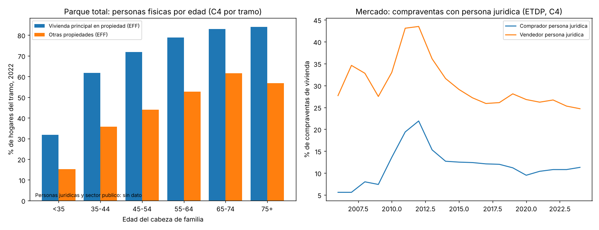

**Lectura.** La propiedad de la vivienda principal está muy extendida y es una cifra C1. La concentración de otras propiedades en los tramos de edad mayores, frente a los menores, es compatible con una transferencia de riqueza inmobiliaria por edad, pero es fuente única. Sobre la propiedad empresarial del parque no hay dato: cualquier cifra que circule sobre ese punto no procede de una estadística pública que el proyecto haya podido localizar.

### 5.2 Empresas (CB)

- Compraventas con comprador persona jurídica: 11,3 % de compraventas en 2024 [C4]. Es un flujo; no dice qué parte del parque poseen las empresas.
- Declarantes del IRPF con rendimientos de capital inmobiliario: 3.262.030 declarantes; con reducción por arrendamiento de vivienda: 2.236.900 declarantes [C4].
- Viviendas equivalentes arrendadas por personas físicas: 2.650.950 viviendas, es decir, 0,81 viviendas/declarante por declarante [C4].
- Frente a las viviendas principales en alquiler del Censo (2.965.500 viviendas), el residual que incluye personas jurídicas, sector público y alquiler no declarado está entre 16,9-38,1 % del stock [C4].
- La AEAT no publica la distribución de arrendadores por número de inmuebles: no se puede contrastar cuánto alquiler está en manos de grandes tenedores.

### 5.3 No residentes (R1A)

- Peso de los compradores extranjeros no residentes: 6,8 % en 2025 frente a 9,9 % en 2015 [C4]. Con residentes, los compradores extranjeros son 16,9 % [C4].
- Entre provincias va de 0,07-32,5 % [C4].
- Asociación entre el peso inicial de no residentes y la subida del precio 2015-2025: bivariada 0,96 % de precio por punto de peso inicial (0,46-1,5 % de precio por punto de peso inicial); con renta, población, costa e islas, 0,02 % de precio por punto de peso inicial (-0,55-0,59 % de precio por punto de peso inicial) [C4]. Con controles el coeficiente no se distingue de cero, pero el intervalo no excluye una asociación de una parte apreciable de la bivariada. No se atribuye la subida a los no residentes ni se descarta.

**Lectura.** Los no residentes son una parte pequeña de las compraventas nacionales, pero muy desigual entre provincias: en algunas del litoral y los archipiélagos pesan mucho más que en el interior. La asociación con la subida de precios es frágil a los controles. No se puede afirmar que los no residentes sean un factor principal de la subida nacional ni que sean irrelevantes en las provincias donde su peso es alto.

### 5.4 Contado (CA)

- Hipotecas sobre vivienda por cada cien compraventas: 70,0 hipotecas por 100 compraventas en 2025 (INE) [C4]. Con Registradores, en 2022-2025, la razón coincide: 71,4-71,7 hipotecas por 100 compraventas en 2022, 65,3-65,8 hipotecas por 100 compraventas en 2023, 66,4-68,4 hipotecas por 100 compraventas en 2024 y 70,0-70,7 hipotecas por 100 compraventas en 2025 [C4].
- Si todas las hipotecas fuesen de compra, el contado sería como mínimo 30,0 % de compraventas de las compraventas [C4]. La cota solo es informativa si la fracción de hipotecas de compra supera 71,4 % de las hipotecas.
- Crédito a construcción y actividades inmobiliarias: de 471,8 miles de millones de euros en 2008 a 97,6 miles de millones de euros en 2025, una caída de -79,3 % [C4]. Es un saldo, no nuevas operaciones.

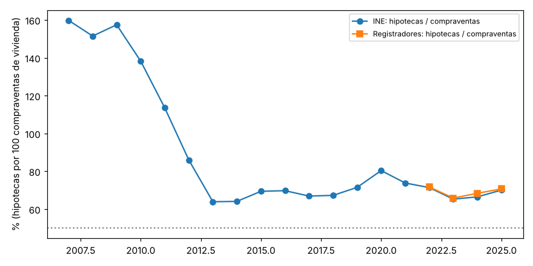

**Lectura.** Hay un volumen grande de compras sin hipoteca, cuya magnitud exacta depende de qué fracción de las hipotecas financia compras de vivienda. Es compatible con compras de inversores y de hogares con ahorro acumulado o con ayuda familiar, pero los datos no separan a unos de otros. El crédito a promotores es una fracción del de la década anterior, lo que es compatible con una financiación de la construcción más restringida, sin que se pueda separar la oferta de crédito de la demanda.

### 5.5 Seguridad jurídica (CB)

- Lanzamientos por la LAU (principalmente impago de alquiler): 18.317 lanzamientos/anio en 2025, frente a un máximo de 38.141 lanzamientos/anio en 2013-2025 [C4].
- Hechos conocidos de allanamiento o usurpación: 14.875 hechos/anio en 2025; procedimientos verbales posesorios por ocupación ingresados: 1.845 procedimientos/anio [C4].
- Frente a 2.965.500 viviendas principales en alquiler, los órdenes de magnitud son pequeños. Con los datos públicos no se puede contrastar si la percepción de inseguridad reduce la oferta de alquiler: la correlación entre comunidades no es un diseño que lo permita.

### 5.6 Fiscalidad (CB)

- La reducción por arrendamiento de vivienda se aplica a 2.236.900 declarantes [C4].
- No hay en el repositorio una evaluación de la incidencia de los cambios fiscales en la oferta de alquiler. La matriz D1 los deja como «no evaluable» (instrumento `I15`).

### 5.7 Desigualdad (CC)

| Grupo | Sobrecarga de coste de vivienda, 2025 | 2015 | Capa |
|---|---|---|---|
| Primer quintil de renta | 27,7 % de personas | 40,9 % de personas | C4 |
| Quinto quintil de renta | 0,20 % de personas | — | C4 |
| Inquilinos a precio de mercado | 26,8 % de personas | 43,3 % de personas | C4 |
| Propietarios con hipoteca | 3,4 % de personas | 8,7 % de personas | C4 |

- Los inquilinos a precio de mercado situados en los tres primeros deciles de renta son 46,9 % de personas inquilinas [C4].
- Hogares jóvenes (de dieciséis a veintinueve años) en propiedad: 30,6 % de hogares en 2025 frente a 34,2 % de hogares en 2015; en vivienda cedida, 14,7 % de hogares frente a 17,4 % de hogares [C4]. En propiedad sin hipoteca, 14,1 % de hogares, que se usa solo como aproximación a la ayuda familiar, no como medida [C4].
- La sobrecarga ha bajado desde 2015 en todos los grupos [C4]. Eurostat-SILC es la ECV del INE: no hay segunda fuente y la cifra es C4.

**Lectura.** La sobrecarga de coste es mucho mayor entre los hogares de renta baja y los inquilinos a precio de mercado que entre los propietarios. Su descenso desde 2015 coincide con el aumento del empleo y de la renta, y con una caída de la proporción de propietarios con hipoteca; no se atribuye a ninguna medida. Los hogares jóvenes en propiedad son menos que en 2015.

### 5.8 Vivienda protegida (CC)

- Calificaciones definitivas de vivienda protegida: 11.265 viviendas/año de media en 2021-2025 [C4].
- Viviendas protegidas que saldrían del régimen en 2026-2035: 594.890 viviendas en el escenario base, entre 532.040 viviendas y 669.394 viviendas [C4]. Los plazos de algunos planes no constan en los reales decretos y se suponen.
- Las salidas anuales serían 5,3 ratio (4,7-5,9 ratio) veces las calificaciones nuevas [C4]. Con un régimen permanente, la cota inferior lógica sería cero.

**Lectura.** Por cada vivienda protegida que se califica, en la próxima década saldrán del régimen varias, según los plazos de los planes antiguos. El parque protegido puede reducirse aunque se mantenga el ritmo de calificaciones, salvo que los plazos se prolonguen o se califiquen más viviendas. Es una contabilidad con supuestos de plazo, no una previsión.

---

## 6. Matriz de instrumentos (D1), resumida

La matriz completa está en [output/v5/D1/matriz_instrumentos.md](D1/matriz_instrumentos.md). Aquí se resume.

**Rúbrica.** La misma para cada instrumento: evidencia y capa, magnitud y rango, signo, plazo, coste fiscal, riesgos, distribución, clase de A4 donde funcionaría y documentos que lo proponen. Se evalúan 36 instrumentos; en 18 instrumentos el signo es «no evaluable» por falta de literatura verificada o de simulación propia [C4]. «No evaluable: motivo» sustituye a cualquier opinión.

**Traslado de las ayudas a la demanda al precio, por clase [C4].** Parte de una ayuda general que captan vendedores o arrendadores, con la rejilla de elasticidades de demanda de v3:

| Clase A4 | Método A (respuesta de oferta de A4) | Método B (rejilla de oferta de v3) |
|---|---|---|
| `1` | 58,4 % (27,8-81,8 %) | 30,9 % (14,6-46,2 %) |
| `2` | 100,0 % (88,1-100,0 %) | 100,0 % |
| `3` | 76,4 % (50,1-89,8 %) | 63,1 % (40,0-76,9 %) |

Los dos métodos discrepan en la clase `1` y se dan ambos.

**Resumen por grupos de instrumentos.**
- **Con signo estable en la rejilla de v3 [C2 en el signo, C4 en la magnitud].** Más construcción donde falta (`P1`) y movilización de vivienda vacía (`I10`, `I27`, `N7`).
- **Con literatura verificada de otros países.** Edificabilidad (`N2`: Büchler y Lutz, 2024; Greenaway-McGrevy y Phillips, 2023) y licencias (`N1`, `I13`: Ball, 2011, solo asociación). Sin evaluación en España.
- **Regulación de precios del alquiler (`I01`).** El resultado propio de v3 (`H3-3`) queda fuera de C3 por la contaminación de la validación; la réplica de García-López y otros no se reproduce con los datos de stock (sección de limitaciones). La literatura verificada da resultados de distinto signo según la oferta. Signo no estable.
- **Ayudas a la demanda (`I06`-`I09`, `N9`).** Su traslado al precio depende de la respuesta de la oferta: alto donde la oferta no responde.
- **Parque público (`I02`).** Signo menor o igual que cero en la rejilla (posiblemente nulo) si desplaza construcción privada.
- **No evaluables.** Rehabilitación, industrialización, seguridad jurídica, fiscalidad de arrendadores, entre otros: sin literatura verificada con magnitud ni simulación propia.

**Cómo leer la matriz.** Cada fila indica qué se sabe del instrumento, con qué capa y de dónde procede la evidencia. Una celda «no evaluable» no es una valoración negativa del instrumento: significa que el proyecto no ha encontrado literatura verificada con magnitud ni ha podido simularlo. Los documentos programáticos que proponen cada instrumento se cuentan con un diccionario de palabras clave cuya precisión estricta es 50,0 % [C4]: son cotas de coincidencias, no recuentos de medidas validadas.

**Lectura.** Con la evidencia disponible, lo que tiene signo estable es aumentar la oferta donde falta y movilizar vacías. Lo que más depende del territorio es el traslado de las ayudas a la demanda: donde la oferta no responde, la mayor parte de una ayuda general acabaría en el precio. Esto no es una recomendación sobre un instrumento concreto: es una condición que cualquier diseño tendría que tener en cuenta.

---

## 7. Política por territorio (D2), en lenguaje condicional

D2 cruza la necesidad de B1, la clase de A4 y la matriz de D1. Todo es C4: no hay efectos estimados por clase en España. El texto completo está en [output/v5/D2/politica_territorio.md](D2/politica_territorio.md).

**Clase `1` (37 provincias, 8 robustas).**
- Necesidad: 189.335 viviendas/año (91.656-268.728 viviendas/año) [C4].
- Si el objetivo fuese cubrir esa necesidad, los instrumentos con signo estable serían más construcción y movilización de vacías.
- La construcción adicional de la rejilla de v3, repartida por cuota de necesidad, cubriría 11,6-46,5 % de la necesidad; las vacías movilizables, 57.230 viviendas/año (28.615-85.845 viviendas/año), el 30,2 % en el central [C4].
- Una ayuda general a la demanda sin más oferta se trasladaría al precio en 27,8-81,8 % (método A) [C4].

**Clase `2` (11 provincias, 3 robustas).**
- Necesidad: 21.689 viviendas/año (1.979-36.383 viviendas/año) [C4].
- La clase se define porque la oferta no responde: si el cuello de botella es de suelo o de tramitación, los instrumentos que actúan sobre él (edificabilidad, licencias) serían los aplicables según la literatura verificada de otros países.
- Construcción adicional: 11,6-46,5 % de la necesidad; vacías: 16.125 viviendas/año (8.063-24.188 viviendas/año), el 74,3 % en el central [C4].
- Una ayuda general a la demanda se trasladaría al precio en 88,1-100,0 % [C4].

**Clase `3`.** Necesidad: 3.130 viviendas/año (-111,0-3.971 viviendas/año) [C4]. Si construir no es rentable con el coste oficial, los instrumentos de oferta privada tendrían poco recorrido sin cambios en coste o suelo.

**Clase `9`.** Necesidad: 716,0 viviendas/año (105,0-842,0 viviendas/año) [C4]. Sin clase: no evaluable.

**Lectura.** Las combinaciones son condicionales: «si el objetivo es X y la provincia está en la clase Y, los instrumentos con signo estable son Z». No son recomendaciones con efecto estimado.

---

## 8. Módulo València

### 8.1 Necesidad y clase

- Déficit contable 2021-2025 de la provincia de València: 68.926 viviendas (59.206-80.093 viviendas) [C4]; de la ciudad, 13.048 viviendas (fuente única) [C4].
- Necesidad anual 2026-2035 de la provincia: 16.993 viviendas/año (13.241-22.407 viviendas/año) [C4].
- Déficit acumulado a fin de 2030 en la provincia: 118.711 viviendas (112.120-128.910 viviendas) [C4]; empeora en todo el rango.
- Clase A4 de la provincia: `1` (falta y es rentable) [C4]. La ciudad pasa de la clase `2` de v4 (coste supuesto, estabilidad 97,2 %) a la clase `1` en v5 con el rango oficial de coste [C4]: el cambio de clase procede del cambio de coste, no de un cambio en el mercado.
- Valor tasado de la vivienda libre en la ciudad: 2.849 €/m² [C4].

### 8.2 Alquiler por distritos (SERPAVI con nombres)

Los distritos censales de SERPAVI se cruzan con los 19 distritos municipales (supuesto declarado: coinciden uno a uno; `output/v5/R1T`). En 2024 hay 65.742 contratos (min-max por distrito) contratos con renta declarada [C4].

| Indicador | Valor | Distrito | Capa |
|---|---|---|---|
| Renta mediana más alta, 2024 | 10,9 €/m²/mes | distrito Ciutat Vella | C4 |
| Renta mediana más baja, 2024 | 5,9 €/m²/mes | distrito Poblats Del Nord | C4 |
| Mediana entre distritos, 2024 | 8,0 €/m²/mes | — | C4 |
| Mayor crecimiento 2015-2024 | 85,8 % | distrito Ciutat Vella | C4 |
| Menor crecimiento 2015-2024 | 50,7 % | distrito Poblats Del Nord | C4 |
| Mediana del crecimiento entre distritos | 73,5 % (50,7-85,8 %) | — | C4 |

La tabla completa por distrito, con nombre, renta mediana de 2015 y 2024, contratos y posición, está en `output/v5/R1T/serpavi_distritos_valencia_nombres.csv`. El centro histórico encabeza a la vez el nivel y el crecimiento; los poblados periféricos tienen pocas observaciones y su crecimiento es menos preciso.

### 8.3 Viviendas turísticas: INE frente a GVA (R1A)

- El registro de la GVA (stock) cuenta 1,6 veces (1,4-1,8 veces) veces las viviendas turísticas que estima el INE en las tres provincias valencianas, 2020-2024 [C4].
- Con el registro vigente de la GVA de octubre de 2026 frente al INE de mayo de 2026, la razón es 1,8 veces (1,4-1,9 veces) [C4].
- La suma de secciones del INE cubre 90,4 % del total provincial [C4].
- La diferencia se descompone en cotas por factor (fechas de baja, definiciones, cobertura); el residual no tiene cota inferior (`BK-052`).

### 8.4 Fianzas de la GVA (A23)

- Mediana de la fianza depositada: 500 € en 2020 y 790 € en 2025 [C4], con 35.079 contratos fianzas en 2025.
- La renta de contratos nuevos (mediana de la fianza) sube 58,0 % en 2020-2025 [C4]; con el IPVA de nuevo contrato, el rango 2021-2024 de la Comunitat Valenciana es 26,6 % (22,4-30,8 %) [C1].
- Rotación (fianzas sobre contratos vigentes): 13,5 % (13,5-15,8 %) [C4].
- Municipios con mediana de fianza que se duplica: 2 municipios [C4].
- Las fianzas no traen la duración del contrato: el alquiler de temporada y por habitaciones sigue sin fuente (`BK-014`).

### 8.5 Heredado de v4

Se mantiene la lectura del módulo València de v4 (`output/v4/informe_tecnico.md`):
- [C4] la provincia de València está entre las tres primeras en déficit contable 2021-2025;
- el componente de nacionalidad extranjera pesa más en la variación de hogares de la provincia que en el conjunto nacional [C4];
- las viviendas turísticas de la ciudad están en 2026 por debajo del nivel de 2021 en la comparación del mismo mes (INE, oleadas experimentales) [C4].

---

## 9. Convergencia con BdE, Ministerio, INE, OCDE y Eurostat (D3)

**Regla.** Una cifra «coincide» o «difiere» solo si concepto, periodo y cobertura son comparables; coincide si los rangos se solapan o si la diferencia entre puntos medios no supera la tolerancia declarada. «Comparable en parte» (otro periodo, concepto o cobertura) no cuenta como coincidencia ni como diferencia. «Control de la misma fuente» es una cifra del organismo con la misma fuente primaria que el proyecto: confirma la transcripción y no cuenta. «No comparable» si el concepto lo impide o la cifra no se localizó. Las diferencias se describen por concepto, periodo, cobertura, método o bajas. No se valora a ningún organismo.

**Resultado [C4].** Coinciden 2; difieren 1; son comparables en parte 6; son controles de la misma fuente 4; no son comparables 9.

| Cifra del proyecto | Organismo | Veredicto | Por qué |
|---|---|---|---|
| Déficit 2021-2024 [C1] | Banco de España (intervenciones públicas) | comparable en parte | periodo distinto (empieza en 2022) y concepto (creación neta de hogares menos producción) |
| Déficit 2021-2025 [C4] | Banco de España (Informe Anual; Informe de Estabilidad Financiera) | coincide | mismo periodo y concepto; comparten insumos primarios |
| Déficit 2021-2025 [C4] | Banco de España (otras ventanas); OCDE | comparable en parte | ventana 2022-2025; la OCDE reproduce la estimación del BdE |
| Terminadas 2019-2024 [C1] | Banco de España | comparable en parte | un solo año, 2025, del organismo |
| Necesidad 2026-2035 [C4] | Ministerio; OCDE | no comparable | cifra del Ministerio no localizada; la de la OCDE es otro concepto (vivienda social) |
| Déficit a 2030 [C4] | Banco de España | no comparable | cifra no localizada |
| Precio 2015-2025, núcleo [C1] | Eurostat (IPV del INE) | difiere | son medidas distintas (puente de precio, sección de diagnóstico) |
| Precio 2015-2025, IPV; alquiler de stock; sobrecarga; emancipación | Eurostat | control de la misma fuente | misma fuente primaria: confirma la transcripción, no la cifra |
| Propiedad de la vivienda principal [C1] | Eurostat | comparable en parte | otro concepto (población frente a hogares) |

La tabla completa, con documento y página de cada organismo, está en [output/v5/D3/convergencia.md](D3/convergencia.md).

**Lectura.** La única diferencia en sentido estricto es la del precio, y se explica por el puente entre el índice del INE y el núcleo de tres fuentes. Las coincidencias en el déficit 2021-2025 comparten insumos con el proyecto; las de Eurostat en sobrecarga, emancipación, precio y alquiler comparten fuente primaria: confirman la transcripción, no la cifra.

**Por qué difieren las cifras de déficit.** La diferencia con las intervenciones del Banco de España sobre el déficit no es de método sino de definición: el organismo mide la creación neta de hogares menos la producción en ventanas que empiezan en 2022, mientras que el proyecto empieza en 2021, el primer año con la corrección de la ruptura de la EPA. Con la ventana 2021-2025 y bajas nulas, el proyecto coincide con las cifras del Informe Anual y del Informe de Estabilidad Financiera. Que coincidan no eleva la capa: el componente de 2025 sigue siendo de fuente única.

**Lo que no se ha podido comparar.** La necesidad a diez años y el déficit a 2030 no tienen una cifra publicada localizable con el mismo concepto. Cuando aparezca, la comparación se añadirá con la misma regla.

---

## 10. Limitaciones y lo que no se puede afirmar

### 10.1 Lo que no se puede afirmar

- **Que una familia de factores «explique» la subida de precios.** Las contribuciones contables no son estables entre métodos ni periodos [C4].
- **Que los grandes tenedores o los fondos determinen los precios.** No hay datos públicos del parque por tipo de propietario. El verificador lo deja en «no analizada: faltan datos».
- **Que los topes al alquiler bajen o suban las rentas en España.** El resultado de v3 está fuera de C3 por contaminación de la validación; la réplica de García-López y otros no se reproduce (coeficiente propio -4,2 milésimas de log-punto por punto de VUT/parque (-7,8--0,54 milésimas de log-punto por punto de VUT/parque), p ajustado 26,9 % (valor p)) porque el stock de SERPAVI recoge solo 55,1 % de la variación del flujo [C4].
- **Que las viviendas turísticas suban el alquiler nacional.** La asociación de v3 no se distingue de cero (0,26 milésimas de log-punto por VUT/100 viv. (-0,74-1,3 milésimas de log-punto por VUT/100 viv.), p ajustado 46,7 % (valor p)); la cota de cantidad es 2,7 % del stock de alquiler [C2].
- **Que haya una burbuja.** Las pruebas de exuberancia (GSADF) con tamaño corregido detectan episodios en algunas razones de precio y no en otras; una exuberancia estadística no es una burbuja (sección de robustez del working paper).
- **Que el pre-registro de B3 confirme una hipótesis.** Su potencia era insuficiente; el resultado es descriptivo.

### 10.2 Verificador de afirmaciones

Se evalúan 33 afirmaciones del debate público: 26 afirmaciones quedan «analizada, no concluyente», 3 afirmaciones «parcialmente», 3 afirmaciones «no analizada: faltan datos» y 1 afirmaciones «contradicha» [C4]. Detalle en [output/v5/verificador/verificador.md](verificador/verificador.md).

### 10.3 Limitaciones de datos y método

- El déficit provincial y la necesidad son C4: dependen de fuentes únicas en algún componente.
- El coste de construcción es un rango oficial derivado de una norma de 1993 y un índice; no es un coste de mercado observado.
- No hay datos públicos de personas jurídicas ni del sector público en el parque, ni de la distribución de arrendadores por número de inmuebles.
- No hay fuente oficial con la duración de los contratos de alquiler (temporada, habitaciones).
- La proyección a 2030 no incorpora la reacción de la oferta ni de la formación de hogares a los precios.
- Las clases de A4 son C4 y todo lo que se apoya en ellas (D1 por clase, D2) también.

### 10.4 Backlog pendiente

Del backlog (`docs/v5/backlog.md`) quedan abiertos o parciales:
- `BK-040`: sensibilidad de los diseños de v2, parcial (sin sensibilidad en un modelo; uno solo con RV aproximado por estar en muestra sellada).
- `BK-014`: alquiler de temporada y por habitaciones, no analizado por falta de datos.
- `BK-017`: réplica con datos privados, no ejecutable.
- `BK-050`, `BK-051`, `BK-042`, `BK-038`: series sin incorporar, tabla de relaciones del seccionado, un bloque de modelos de v2 y un análisis de v3 no especificado ni pre-registrado.
- Abiertos por fuentes: Atlas de Áreas Urbanas (`BK-041`), afiliación de la construcción por provincia (`BK-009`), Notariado y Registradores por residencia del comprador (`BK-002`).
- Solicitudes de datos a organismos: `docs/v5/solicitudes.md`.

### 10.5 Qué datos cambiarían las conclusiones

- **Parque por tipo de propietario** (Catastro por titular, con personas jurídicas y sector público): permitiría pasar de «no analizada» a una cifra en las afirmaciones sobre grandes tenedores.
- **Distribución de arrendadores por número de inmuebles** (AEAT): separaría pequeños y grandes arrendadores.
- **Duración de los contratos de alquiler** (registros de fianzas de todas las comunidades): permitiría medir el alquiler de temporada y por habitaciones.
- **Una segunda fuente de hogares en 2025**: subiría el déficit 2021-2025 de C4 a C1 si los componentes coincidieran.
- **Coste de construcción observado** (no derivado de una norma): reduciría la incertidumbre de las clases de A4 y, con ella, la de todo lo que se apoya en las clases.
- **Microdatos de transacciones con residencia del comprador por provincia** (Notariado y Registradores): elevarían la capa de las cifras sobre no residentes.

Las solicitudes a organismos están en `docs/v5/solicitudes.md`. Ninguna conclusión de este informe depende de datos privados.

---

## Anexo A. Datos y fuentes

| Bloque | Fuentes | Ruta |
|---|---|---|
| Hogares | INE ECP, EPA (corregida por la ruptura de 2021), proyecciones de hogares | `output/v5/B1`, `output/v5/B2` |
| Terminadas e iniciadas | Ministerio (certificados de fin de obra, visados), Catastro (altas) | `output/v5/B2`, `output/v5/R1C` |
| Precio de compra | INE IPV; Ministerio (valor tasado); Notariado; Registradores | `output/v5/A23` |
| Alquiler | INE IPC e IPVA; SERPAVI; Incasòl; fianzas de la GVA | `output/v5/A23`, `output/v5/R1T` |
| Coste de construcción | BOE (módulo básico); Eurostat (índice de costes) | `output/v5/A4` |
| Europa | Eurostat (HPI, IPCA, SILC, permisos, demografía) | `output/v5/CA` |
| Crédito y contado | BdE (Boletín Estadístico); INE (hipotecas, transmisiones); Registradores | `output/v5/CA` |
| Parque y propiedad | INE Censo 2021, ECV; BdE EFF; AEAT | `output/v5/R1C`, `output/v5/CB`, `output/v5/CC` |
| Seguridad jurídica | CGPJ; Ministerio del Interior | `output/v5/CB` |
| Vivienda protegida | Ministerio (Boletín), BOE | `output/v5/CC` |
| Viviendas turísticas | INE (estadística experimental); GVA (registro de turismo) | `output/v5/R1A` |
| Convergencia | BdE, Ministerio, INE, OCDE, Eurostat | `output/v5/D3` |

Licencias: `docs/v5/licencias_datos.md`. Fuentes fallidas: `docs/v5/fuentes_fallidas.md`. Fichas de cada cifra: `output/v5/cifras_clave.md`.

## Anexo B. Replicación

- `make all` reconstruye todo sin red; las descargas están en los scripts `*_fetch.py`, fuera de `make all`.
- `make check` ejecuta `src/v5/check_v5.py` (cifras fuera de marcador, sumas provinciales iguales al total nacional, capas válidas) y `src/v3/check_texto.py` (léxico valorativo o partidista y lenguaje causal por debajo de C3).
- Este informe se genera con `python3 src/v5/render.py` desde `docs/v5/plantillas/informe_tecnico.md`.
- Toda especificación probada está en los `registro.csv` de cada módulo; la muestra sellada solo se usa vía `src/holdout.py`.
- Semilla: `SEED=20261010` en todo lo aleatorio.

## Declaración de independencia y uso de inteligencia artificial

Este informe es un trabajo individual e independiente de Borja Romero, economista, sin financiación externa ni vínculo con partidos políticos. Evalúa afirmaciones e instrumentos, nunca partidos ni personas. El análisis, el código y los borradores se elaboraron con agentes de inteligencia artificial (Claude), bajo la supervisión del autor, que revisa y asume la responsabilidad del contenido. El detalle está en el apéndice C del working paper y en README_REPLICACION.md. Las correcciones se publican en ERRATA.md.
